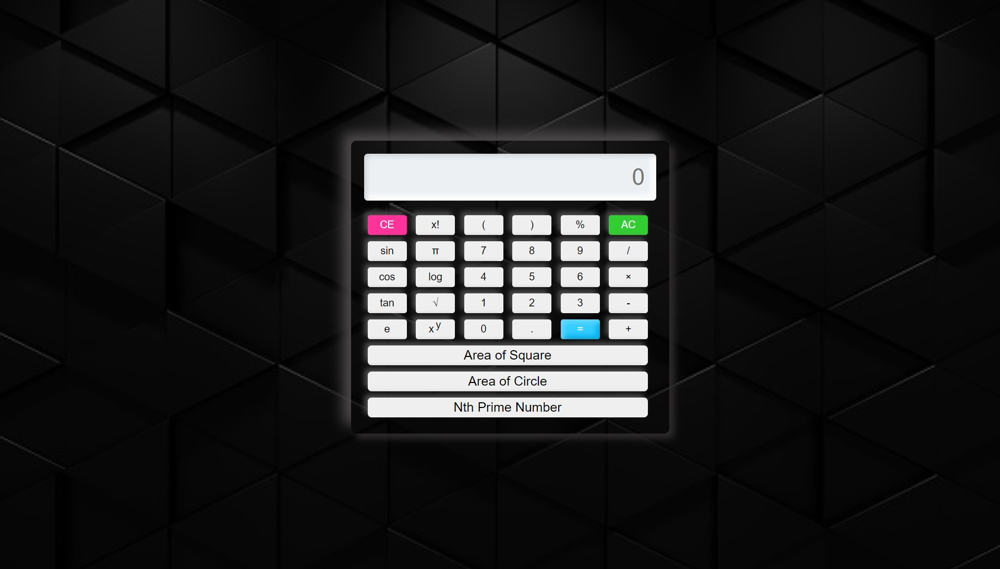

# Calculator-with-various-features
> A web page is created which displays a calculator which can do the following functions
- Do all the basic operations
- Can solve expressions
- It can calculate area of circle and square 
- It can find the Nth Prime Number
- Do some scientific operations

